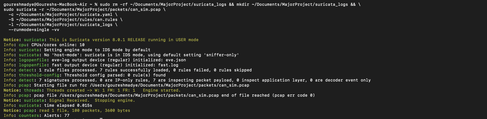
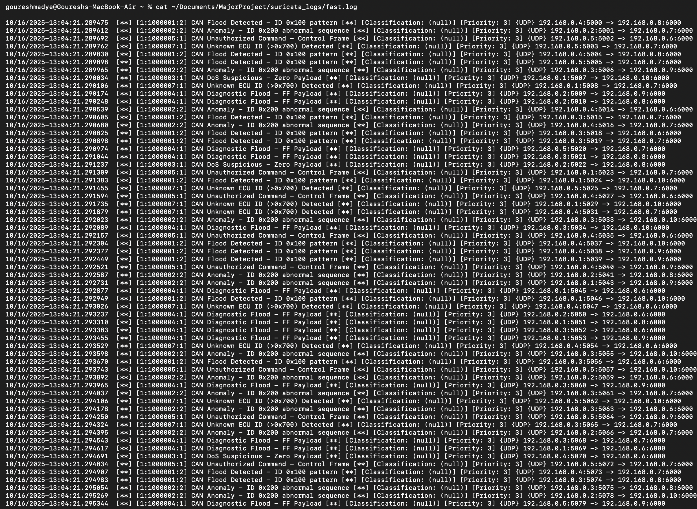

# 🚗 CAN Bus Intrusion Detection System with Suricata

A comprehensive intrusion detection system for Controller Area Network (CAN) bus traffic using Suricata IDS. This project detects various CAN bus attacks including flood attacks, anomalous sequences, DoS attempts, unauthorized commands, and unknown ECU IDs.

## 📋 Table of Contents

- [Features](#features)
- [Project Structure](#project-structure)
- [Prerequisites](#prerequisites)
- [Installation](#installation)
- [Usage](#usage)
- [Visualization](#visualization)
- [Detection Rules](#detection-rules)
- [Screenshots](#screenshots)
- [Troubleshooting](#troubleshooting)

## ✨ Features

- **CAN Traffic Generation**: Simulate CAN bus traffic with various attack patterns
- **Intrusion Detection**: Real-time detection of CAN bus attacks using Suricata
- **Custom Rules**: Comprehensive rule set for CAN-specific threats
- **Log Analysis**: Parse and analyze Suricata logs
- **Visualization**: Interactive visualizations of detected alerts

### Detected Threats

1. **CAN Flood Detection** - High-frequency repeated CAN ID patterns
2. **Anomaly Detection** - Abnormal message sequences
3. **DoS Attacks** - Zero payload suspicious patterns
4. **Diagnostic Floods** - FF payload flooding
5. **Unauthorized Commands** - Control frame anomalies
6. **Unknown ECU IDs** - Detection of unregistered ECU identifiers (>0x700)

## 📁 Project Structure

```
MajorProject/
├── packets/
│   └── can_sim.pcap              # Generated CAN traffic capture
├── code/
│   └── generate_pcap.py          # PCAP generator for CAN traffic
│   └── visualize_fastlog.ipynb   # Jupyter notebook for visualization
├── suricata.yaml                 # Suricata configuration
├── rules/
│   └── can.rules             # Custom CAN detection rules
├── suricata_logs/            # Suricata output directory
│   ├── fast.log              # Alert summary
│   └── eve.json              # Detailed JSON logs
├── requirements.txt          # Python dependencies
├── screenshots/              # Documentation screenshots
│   ├── suricata_application.png
│   └── logs.png
└── README.md                 # This file
```

## 🔧 Prerequisites

### System Requirements

- **Operating System**: macOS, Linux, or Windows (WSL)
- **Python**: 3.10 or higher
- **Suricata IDS**: 7.0.0 or higher
- **Sudo Access**: Required for Suricata execution

### macOS Installation

```bash
# Install Homebrew (if not already installed)
/bin/bash -c "$(curl -fsSL https://raw.githubusercontent.com/Homebrew/install/HEAD/install.sh)"

# Install Suricata
brew install suricata

# Verify installation
suricata --version
```

### Linux (Ubuntu/Debian) Installation

```bash
# Add Suricata PPA
sudo add-apt-repository ppa:oisf/suricata-stable
sudo apt-get update

# Install Suricata
sudo apt-get install suricata

# Verify installation
suricata --version
```

## 📦 Installation

### 1. Clone or Download the Project

```bash
cd ~/Documents/MajorProject
```

### 2. Install Python Dependencies

#### Option A: Using Virtual Environment (Recommended)

```bash
# Create virtual environment
python3 -m venv .venv

# Activate virtual environment
source .venv/bin/activate  # On macOS/Linux
# OR
.venv\Scripts\activate     # On Windows

# Upgrade pip and install dependencies
python3 -m pip install --upgrade pip
python3 -m pip install -r requirements.txt
```

#### Option B: Using Conda/Miniforge

```bash
# Create conda environment
conda create -n can-ids python=3.11 -y

# Activate environment
conda activate can-ids

# Install dependencies from conda-forge
conda install -c conda-forge pandas matplotlib seaborn jupyter -y
```

#### Option C: System-wide Installation

```bash
python3 -m pip install --upgrade pip
python3 -m pip install -r requirements.txt
```

## 🚀 Usage

### Step 1: Generate CAN Traffic

Generate simulated CAN bus traffic with attack patterns:

```bash
python3 generate_pcap.py
```

**Output**: Creates `packets/can_sim.pcap` with simulated CAN traffic including various attack vectors.

### Step 2: Run Suricata IDS

Execute Suricata to analyze the generated PCAP file:

```bash
# Clean previous logs and create fresh output directory
sudo rm -rf ~/Documents/MajorProject/suricata_logs && \
mkdir ~/Documents/MajorProject/suricata_logs

# Run Suricata analysis
sudo suricata -r ~/Documents/MajorProject/packets/can_sim.pcap \
  -c ~/Documents/MajorProject/suricata.yaml \
  -S ~/Documents/MajorProject/rules/can.rules \
  -l ~/Documents/MajorProject/suricata_logs \
  --runmode=single -vv
```

**Parameters Explained:**

- `-r`: Read from PCAP file
- `-c`: Suricata configuration file
- `-S`: Custom rules file
- `-l`: Log output directory
- `--runmode=single`: Single-threaded mode for consistent results
- `-vv`: Verbose output for debugging

**Expected Output:**

- `suricata_logs/fast.log` - Human-readable alert summary
- `suricata_logs/eve.json` - JSON format detailed logs
- Console output showing detected alerts



#### Suricata Logs

After running Suricata, check the generated logs:

```bash
# View fast.log (alert summary)
cat ~/Documents/MajorProject/suricata_logs/fast.log

# Count alerts by type
grep -o '\[.*\]' ~/Documents/MajorProject/suricata_logs/fast.log | sort | uniq -c
```



### Step 3: Visualize Results

#### Using Jupyter Notebook

1. **Start Jupyter Notebook**:

   ```bash
   # If using virtual environment, make sure it's activated
   jupyter notebook
   ```

2. **Open the notebook**:

   - Navigate to `visualize_fastlog.ipynb`
   - Run all cells sequentially (Cell → Run All)

3. **Interactive Analysis**:
   The notebook provides:
   - Alert frequency bar charts
   - Timeline visualization of attacks
   - Source vs Destination IP heatmaps
   - Statistical summaries

#### Using Python Script (Alternative)

If you prefer to run analysis without Jupyter:

```bash
python3 -c "
import pandas as pd
import re
from datetime import datetime

# Read and parse fast.log
with open('suricata_logs/fast.log', 'r') as f:
    lines = [l.strip() for l in f if l.strip()]

pattern = re.compile(
    r'(?P<timestamp>\d{2}/\d{2}/\d{4}-\d{2}:\d{2}:\d{2}\.\d+).*\[(?P<gid>\d+):(?P<sid>\d+):(?P<rev>\d+)\]\s+(?P<alert>.*?)\s+\[\*\*\]'
)

records = []
for line in lines:
    match = pattern.search(line)
    if match:
        records.append(match.groupdict())

df = pd.DataFrame(records)
print('\n📊 Alert Summary:')
print(df['alert'].value_counts())
print(f'\n🔢 Total Alerts: {len(df)}')
print(f'📡 Unique Source IPs: {df[\"alert\"].nunique()}')
"
```

## 📊 Visualization

The `visualize_fastlog.ipynb` notebook provides comprehensive visualizations:

### 1. Alert Frequency Analysis

- Bar chart showing count of each alert type
- Identifies most common attack vectors

### 2. Timeline Visualization

- Chronological view of all detected alerts
- Helps identify attack patterns and timing

### 3. Network Heatmap

- Source IP vs Destination IP matrix
- Visualizes communication patterns
- Highlights suspicious connections

### Sample Output

```
Parsed 78 alerts, skipped 0 lines.

📈 Summary of Alerts:
CAN Anomaly - ID 0x200 abnormal sequence          22
CAN Flood Detected - ID 0x100 pattern             21
CAN Diagnostic Flood - FF Payload                 15
CAN Unknown ECU ID (>0x700) Detected              13
CAN Unauthorized Command - Control Frame          10
CAN DoS Suspicious - Zero Payload                  4

Unique Source IPs: 5
Unique Destination IPs: 5
```

## 🛡️ Detection Rules

### Rule Format

Each CAN detection rule in `rules/can.rules` follows this structure:

```
alert udp any any -> any any (msg:"Alert Message";
content:"pattern"; sid:XXXXXX; rev:X; priority:3;)
```

### Current Rule Set

| SID     | Alert Type               | Description                 |
| ------- | ------------------------ | --------------------------- |
| 1000001 | CAN Flood Detected       | Repeated ID 0x100 patterns  |
| 1000002 | CAN Anomaly              | ID 0x200 abnormal sequences |
| 1000003 | CAN DoS Suspicious       | Zero payload attacks        |
| 1000004 | CAN Diagnostic Flood     | FF payload flooding         |
| 1000005 | CAN Unauthorized Command | Control frame anomalies     |
| 1000007 | CAN Unknown ECU ID       | ECU IDs greater than 0x700  |

### Adding Custom Rules

Edit `rules/can.rules` to add new detection patterns:

```bash
# Example: Detect specific CAN ID
alert udp any any -> any any (msg:"CAN Custom ID 0x300 Detected";
content:"|03 00|"; sid:1000010; rev:1; priority:2;)
```

## 🖼️ Screenshots

### Suricata Implementation


### Generated Logs


## 🔍 Troubleshooting

### Common Issues

#### 1. Suricata Permission Denied

**Error**: `Permission denied when accessing PCAP`

**Solution**:

```bash
# Run with sudo
sudo suricata -r ...

# OR change file permissions
chmod 644 ~/Documents/MajorProject/packets/can_sim.pcap
```

#### 2. Python Package Installation Fails

**Error**: `Failed building wheel for matplotlib`

**Solution for macOS**:

```bash
# Install system dependencies
xcode-select --install
brew install pkg-config freetype libpng

# Retry installation
python3 -m pip install -r requirements.txt
```

**Alternative**: Use conda/miniforge (see Installation section)

#### 3. Suricata Not Found

**Error**: `suricata: command not found`

**Solution**:

```bash
# macOS
brew install suricata

# Linux
sudo apt-get install suricata

# Verify
which suricata
```

#### 4. Empty Log Files

**Problem**: `suricata_logs/fast.log` is empty

**Solutions**:

1. Check if PCAP file exists and has content
2. Verify rules file path is correct
3. Run Suricata with `-vv` flag for verbose output
4. Check Suricata version compatibility

#### 5. Jupyter Notebook Kernel Issues

**Error**: Kernel errors or import failures

**Solution**:

```bash
# Reinstall kernel
python3 -m ipykernel install --user --name=can-ids

# Start Jupyter with specific kernel
jupyter notebook --kernel=can-ids
```

### Debug Mode

Run Suricata with maximum verbosity for troubleshooting:

```bash
sudo suricata -r ~/Documents/MajorProject/packets/can_sim.pcap \
  -c ~/Documents/MajorProject/suricata.yaml \
  -S ~/Documents/MajorProject/rules/can.rules \
  -l ~/Documents/MajorProject/suricata_logs \
  --runmode=single -vvv --log-level=debug
```

## 🎯 Expected Results

After completing all steps successfully, you should have:

✅ Generated PCAP file with simulated CAN traffic  
✅ Suricata logs showing 70-100+ detected alerts  
✅ `fast.log` with human-readable alert summaries  
✅ `eve.json` with detailed JSON event logs  
✅ Interactive visualizations in Jupyter notebook  
✅ Statistical analysis of attack patterns

## 📚 Additional Resources

- [Suricata Documentation](https://suricata.readthedocs.io/)
- [CAN Bus Protocol Overview](https://en.wikipedia.org/wiki/CAN_bus)
- [Writing Suricata Rules](https://suricata.readthedocs.io/en/latest/rules/)

## 🤝 Contributing

Feel free to enhance this project by:

- Adding new attack patterns
- Creating additional detection rules
- Improving visualization techniques
- Optimizing performance

## 📄 License

This project is for educational and research purposes.

---

## 🎉 Happy Output!

Once you've completed all steps, you'll have a fully functional CAN bus intrusion detection system with comprehensive logging and visualization capabilities!

**Quick Start Summary:**

```bash
# 1. Generate traffic
python3 generate_pcap.py

# 2. Run Suricata
sudo suricata -r ~/Documents/MajorProject/packets/can_sim.pcap \
  -c ~/Documents/MajorProject/suricata.yaml \
  -S ~/Documents/MajorProject/rules/can.rules \
  -l ~/Documents/MajorProject/suricata_logs \
  --runmode=single -vv

# 3. Visualize
jupyter notebook visualize_fastlog.ipynb
```

**Enjoy detecting CAN bus intrusions! 🚀**
