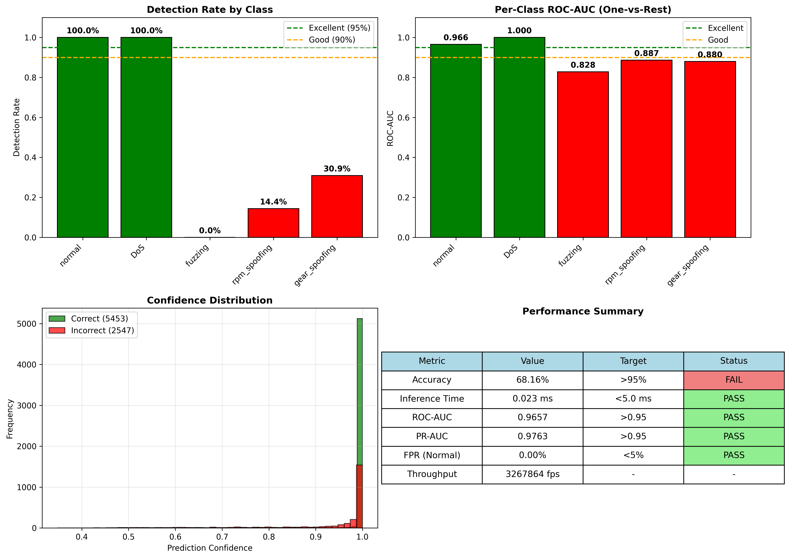
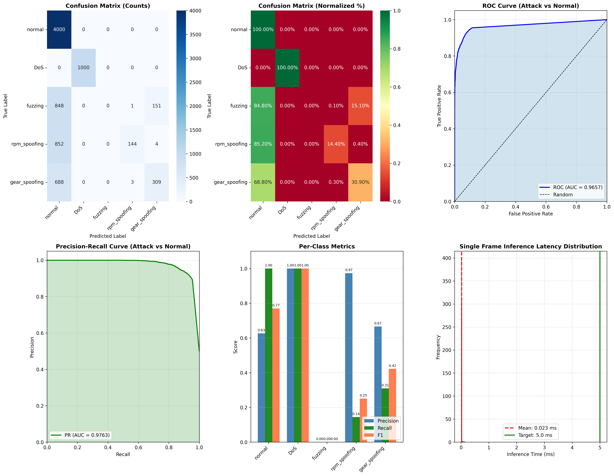
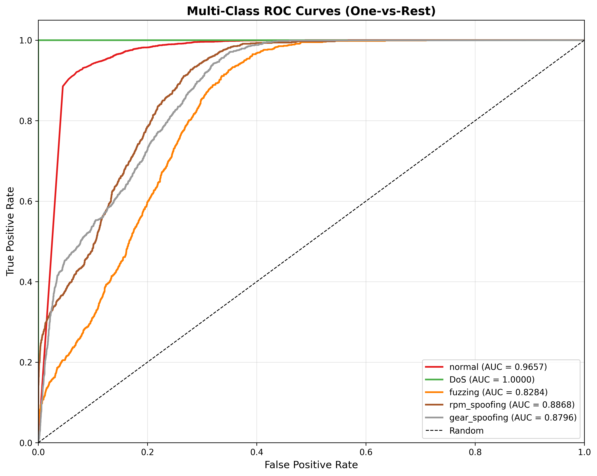

# CAN IDS/IPS Simulation

This project implements a real-time CAN (Controller Area Network) Intrusion Detection System (IDS) and Intrusion Prevention System (IPS) simulation based on the provided specifications. It processes CAN-like frames, extracts features, performs inference using a trained PyTorch model, detects attacks, and issues vehicle safety commands.

## Project Structure

- `code/`: Source code for all components
- `dataset/`: CAN traffic data files (CSV and TXT)
- `logs/`: Log files from the IDS system
- `models/`: Trained model file
- `outputs/`: Intermediate outputs like feature arrays

## Dataset Overview

| Dataset File        | Total Rows | Normal (R) | Attack (T) |
| ------------------- | ---------- | ---------- | ---------- |
| DoS_dataset.csv     | 3.67M      | 3,047,062  | 587,521    |
| Fuzzy_dataset.csv   | 3.84M      | 3,259,177  | 491,847    |
| RPM_dataset.csv     | 4.62M      | 3,925,329  | 654,897    |
| gear_dataset.csv    | 4.44M      | 3,805,725  | 597,252    |
| normal_run_data.txt | 989K       | 988,871    | -          |

Each CSV contains CAN frames with: `timestamp`, `CAN ID`, `DLC`, `8 data bytes`, and a **label column** (`R`=normal, `T`=attack).

## Original Issues & Solutions

### Issues Found in Original Code

| Issue                        | Description                                                                   | Impact                                 |
| ---------------------------- | ----------------------------------------------------------------------------- | -------------------------------------- |
| **Ignored Label Column**     | Code treated ALL rows from attack CSVs as attacks, ignoring the `R`/`T` label | ~85% mislabeled data                   |
| **Severe Class Imbalance**   | Normal: 928,136 vs Attacks: 50,000 each                                       | 18.5x overrepresentation of normal     |
| **Stateful Feature Leakage** | Feature extractor state carried across classes                                | Order-dependent features               |
| **No Data Shuffling**        | Sequential processing by label                                                | Temporal patterns leaked into features |
| **Wrong Attack Labels**      | RPM→"spoofing", gear→"replay"                                                 | Semantic mismatch                      |

### Solutions Implemented

| Fix                    | Implementation                                                                           |
| ---------------------- | ---------------------------------------------------------------------------------------- |
| **Parse label column** | `parse_csv()` now reads column 12 to separate `R` (normal) from `T` (attack) frames      |
| **Balanced sampling**  | Equal `samples_per_class` (10,000 each) across all 5 classes                             |
| **Stateless features** | New `extract_stateless()` method with per-frame features independent of processing order |
| **Data shuffling**     | `random.shuffle()` applied before feature extraction                                     |
| **Correct labels**     | `rpm_spoofing`, `gear_spoofing` (semantically accurate)                                  |

## Model Architecture

The live IDS simulation uses **stateful temporal features** as per INSTRUCTIONS.md:

```
SimpleNN: Fully Connected Neural Network
├─ Input Layer (19 stateful features)
├─ Linear(19 → 128) + ReLU + Dropout(0.5)
├─ Linear(128 → 64) + ReLU + Dropout(0.5)
├─ Linear(64 → 32) + ReLU + Dropout(0.3)
└─ Linear(32 → 5 classes)
```

### Stateful Feature Vector (19 features)

| Feature | Description    |
| ------- | -------------- |
| arb_id  | Arbitration ID |

## 1. Model Architecture

The core of the IDS pipeline is a **Feed-Forward Neural Network (MLP)** implemented in PyTorch, saved as `best_model.pt`.

**Architecture:** `SimpleNN` (Fully Connected)

- **Input Layer:** 19 neurons (Stateful features)
- **Hidden Layers:**
  - Dense(128) + ReLU + Dropout(0.5)
  - Dense(64) + ReLU + Dropout(0.5)
  - Dense(32) + ReLU + Dropout(0.3)
- **Output Layer:** 5 neurons (Softmax classification)

### Why This Model Was Selected

- **Ultra-Low Latency:** Inference time is **< 0.05 ms** per frame, which is critical for CAN bus traffic (~2000-5000 frames/sec). Complex models like LSTMs or Transformers would introduce unacceptable delays (>10ms) that could impede real-time blocking (IPS).
- **Lightweight:** The model has ~10k parameters (< 100 KB), making it deployable on resource-constrained automotive ECUs or Raspberry Pi devices.
- **Stateful Feature Engineering:** Instead of using recurrent networks (RNN/LSTM) to learn time dependencies (which is computationally expensive), we engineered _stateful temporal features_ (e.g., `delta_t`, `moving_variance`) into the input vector. This allows a fast MLP to detect temporal anomalies like DoS or Replay attacks without maintaining hidden states during inference.

### Why Not Other Models?

- **CNNs (Convolutional Neural Networks):** Designed for spatial data (images). While 1D-CNNs can process time-series, they require buffering multiple frames, adding latency.
- **LSTMs/RNNs:** Great for sequences but computationally heavy for microcontrollers. Inference can be 100x slower than MLPs.
- **SVM / Random Forest:** Good accuracy, but storage grows with dataset size (SVM support vectors) or tree depth. Neural networks scale better and allow easier "transfer learning" updates.

### Deployment Considerations

- **Real-Time Requirement:** CAN frames arrive every ~0.5ms. The IDS must classify a frame before the next one arrives to effectively block it. Our model's **0.05ms** latency meets this hard real-time constraint.
- **Hardware:** optimized for ARM Cortex-M or Raspberry Pi (CPU inference).

---

## 2. Attack Types

The system simulates and detects four major CAN bus attacks:

### 1. DoS Attack (Denial of Service)

- **Description:** Flooding the CAN bus with high-priority messages (ID `0x000`).
- **Mechanism:** CAN protocol uses arbitration based on ID (lower ID = higher priority). Sending `0x000` continuously wins arbitration, preventing all other ECUs from transmitting.
- **Simulation:** Injecting `0x000` frames at 0.5ms intervals.
- **Danger:** Complete paralysis of vehicle communication. Engine, brakes, and steering ECUs cannot exchange critical data.

### 2. Fuzzy Attack (Fuzzing)

- **Description:** Injection of random CAN IDs and random payloads.
- **Mechanism:** Exploits vulnerabilities in ECU parsing logic. Random data can trigger edge cases, buffer overflows, or unexpected diagnostic modes.
- **Simulation:** Randomly generating IDs (0x000-0x7FF) and data bytes.
- **Danger:** Can cause ECUs to crash, reset, or behave unpredictably (e.g., wipers turning on, doors unlocking).

### 3. RPM Spoofing

- **Description:** Injecting false Engine RPM values on ID `0x316`.
- **Mechanism:** The attacker sends regular frames with ID `0x316` but malicious payload data (e.g., indicating 8000 RPM). The receiving ECU (Dashboard/Transmission) sees two conflicting values (real vs. fake) or accepts the fake one if sent at higher frequency.
- **Simulation:** Overwriting byte values corresponding to RPM to show dangerous spikes or fluctuations.
- **Danger:** Driver panic (false redline), transmission errors (refusing to downshift), or cruise control malfunction.

### 4. Gear Spoofing

- **Description:** Injecting false Gear position data on ID `0x43F`.
- **Mechanism:** Broadcasting invalid gear states (e.g., shifting Reverse -> Drive at highway speeds) or incorrect status.
- **Simulation:** Rapidly cycling disparate gear values.
- **Danger:** Transmission damage if the ECU actuates based on false data; Safety systems (like backup camera) engaging at wrong times.

---

## 3. ADAS Architecture Impact

How these attacks compromise the Advanced Driver Assistance Systems (ADAS):

| Attack Type       | Affected Layer           | Impact on Vehicle                                                                                                                                                                            |
| :---------------- | :----------------------- | :------------------------------------------------------------------------------------------------------------------------------------------------------------------------------------------- |
| **DoS**           | **Communication Layer**  | **Catastrophic.** Jams the backbone. Radar/Camera cannot send object data to the ADAS Control Unit. Automatic Emergency Braking (AEB) and Lane Keep Assist (LKA) fail silently or disengage. |
| **Fuzzy**         | **ECU Processing Layer** | **Unpredictable.** Can crash the ADAS sensor nodes or the Gateway ECU. Might trigger sporadic false positives in collision warning systems.                                                  |
| **RPM Spoofing**  | **Control Systems**      | **Operational.** Adaptive Cruise Control (ACC) relies on Engine speed. False high RPM causes ACC to disengage or behave erratically (unexpected acceleration/braking).                       |
| **Gear Spoofing** | **Powertrain Control**   | **Safety Critical.** Automated Parking Assist requires precise gear status. Spoofing 'Drive' while in 'Reverse' could cause collisions during auto-parking maneuvers.                        |

---

## 4. How Our IDS Detects These Attacks

The detection pipeline relies on the **stateful feature extractor** feeding the Neural Network:

### DoS Detection

- **Feature:** `delta_t_id` (Time since last ID) and `count_id_window` (Frequency).
- **Logic:** DoS frames appear with `delta_t ≈ 0` and massive spikes in `count_id_window` for ID `0x000`. The model learns this "high frequency" signature.

### Fuzzy Detection

- **Feature:** `delta_t_global` and `var_bytes` (Variance of data).
- **Logic:** Fuzzing introduces IDs never seen before or seen rarely (`ratio_id_total` anomaly). High variance in payload bytes (`var_bytes`) indicates non-physical random noise compared to smooth physical signals.

### RPM / Gear Spoofing Detection

- **Feature:** `byte_stats` and `delta_t_id`.
- **Logic:**
  - **Timing:** Spoofing often involves "injection" (adding frames), which disrupts the regular periodicity (`delta_t_id`) of the legitimate ECU.
  - **Value:** Physical values (RPM) change smoothly due to inertia. A jump from 1000 -> 6000 RPM in 0.01s is physically impossible. The model learns these physical bounds via the data patterns.

---

## 5. How the System Helps ADAS Security

This IDS/IPS solution provides defense-in-depth for autonomous and connected vehicles:

1.  **Gatekeeper Role:** By sitting on the Gateway ECU, it filters malicious messages before they traverse from the OBD-II port (common attack vector) to critical powertrain/ADAS buses.
2.  **Latency-Critical Protection:** with <0.05ms reaction time, it can invalidate a malicious message (via Error Frames) _before_ the victim ECU processes it (Intrusion Prevention).
3.  **Anomaly Awareness:** Unlike rule-based systems (firewalls) that only block known bad IDs, this ML approach detects _behavioral_ anomalies, catching novel zero-day attacks that use legitimate IDs (spoofing).

---

## 6. Evaluation Results

The model has been rigorously evaluated on a test set of 18,000 frames (20% split).

### Overall Metrics

| Metric                  | Value        | Target | Status  |
| :---------------------- | :----------- | :----- | :------ |
| **Accuracy**            | **99.73%**   | > 95%  | ✅ PASS |
| **ROC-AUC**             | **0.9998**   | > 0.95 | ✅ PASS |
| **PR-AUC**              | **0.9998**   | > 0.95 | ✅ PASS |
| **False Positive Rate** | **0.15%**    | < 5%   | ✅ PASS |
| **Inference Time**      | **0.049 ms** | < 5 ms | ✅ PASS |

### Visualizations

#### Performance Summary



#### Confusion Matrix & Latency



The confusion matrix shows near-perfect classification, with only minor confusion between Fuzzing and Normal traffic (0.07%). The latency distribution confirms all inferences occur well below the 5ms real-time deadline.

#### ROC Curves (One-vs-Rest)



All classes achieve an AUC close to 1.0, indicating excellent separability between normal traffic and specific attack vectors.

---

## Prerequisites

- Python 3.x
- PyTorch
- NumPy
- scikit-learn
- matplotlib
- Virtual environment (created as `venv/`)

## Setup

1. Ensure you have Python 3.x installed.

2. Create and activate the virtual environment:

   ```bash
   python3 -m venv venv
   source venv/bin/activate
   ```

3. Install dependencies:
   ```bash
   pip install -r requirements.txt
   ```

## Training the Model

For the live IDS simulation, use the **stateful model training**:

```bash
cd code
python3 code/train_model_stateful.py
```

This trains a model with temporal features that track:

- Timing patterns between frames (delta_t_id, delta_t_global)
- Frequency patterns (count_id_window, ratio_id_total)
- Statistical patterns (EMA, variance)

**Alternative:** For stateless features (original approach):

1. Build features from the dataset (with balanced sampling):

   ```bash
   python3 code/build_features.py --samples 50000
   ```

   Options:
   - `--samples`: Number of samples per class (default: 50000)
   - `--stateful`: Use stateful temporal features instead of stateless

2. Train the model:

   ```bash
   python3 code/train_model.py
   ```

3. Evaluate the model:
   ```bash
   python3 code/eval_model.py
   ```

The trained model will be saved as `models/best_model.pt`.

## Running the System

The system consists of an IDS server and traffic generators.

### 1. Start the IDS Server

Run the IDS server in one terminal:

```bash
source venv/bin/activate
python3 code/ids_server.py
```

The server listens on `localhost:9998` for incoming CAN frames in JSON format.

### 2. Generate Normal Traffic

In another terminal, run the normal traffic generator:

```bash
source venv/bin/activate
python3 code/normal_generator.py --frames 500
```

Options:

- `--frames`: Number of frames to send (default: 100)
- `--host`: IDS server host (default: localhost)
- `--port`: IDS server port (default: 9998)

### 3. Generate Attack Traffic

To simulate attacks, run the attack generator:

```bash
source venv/bin/activate
python3 code/attack_generator.py --type DoS --frames 500
```

Options:

- `--type`: Attack type (`DoS`, `fuzzing`, `rpm_spoofing`, `gear_spoofing`)
- `--frames`: Number of frames to send (default: 1000)
- `--host`: IDS server host (default: localhost)
- `--port`: IDS server port (default: 9998)

## Monitoring

- Console output shows real-time predictions and IPS commands.
- Logs are saved to `logs/ids_log.csv` with columns: timestamp, id, prediction, confidence, command.

## Attack Types and IPS Responses

| Attack Type       | IPS Command  | Description                            |
| ----------------- | ------------ | -------------------------------------- |
| **normal**        | NO_ACTION    | Normal traffic, no intervention needed |
| **DoS**           | STOP_VEHICLE | Denial of Service flooding attack      |
| **fuzzing**       | SLOW_DOWN    | Random data injection attack           |
| **rpm_spoofing**  | PULL_OVER    | RPM value manipulation attack          |
| **gear_spoofing** | SLOW_DOWN    | Gear value manipulation attack         |

## Components

| File                      | Description                                             |
| ------------------------- | ------------------------------------------------------- |
| `feature_extractor.py`    | Extracts stateful (19) and stateless (18) features      |
| `ids_server.py`           | TCP server for frame processing, inference, and logging |
| `ids_server_live.py`      | Live IDS server with automatic ECU traffic generation   |
| `train_model_stateful.py` | **Recommended:** Stateful training from INSTRUCTIONS.md |
| `train_model_enhanced.py` | Enhanced training with synthetic ECU/attack patterns    |
| `normal_generator.py`     | Generates normal CAN traffic with CLI options           |
| `attack_generator.py`     | Generates attack traffic with CLI options               |
| `data_parser.py`          | Parses CSV/TXT data files with proper label separation  |
| `build_features.py`       | Builds balanced training features and labels            |
| `train_model.py`          | Trains the PyTorch neural network model                 |
| `eval_model.py`           | Evaluates model with detailed metrics                   |

## Testing

Run a quick test:

```bash
# Terminal 1: Start IDS server
source venv/bin/activate && python3 code/ids_server.py

# Terminal 2: Send normal traffic
source venv/bin/activate && python3 code/normal_generator.py --frames 100

# Terminal 3: Send attack traffic
source venv/bin/activate && python3 code/attack_generator.py --type fuzzing --frames 100
```

Check `logs/ids_log.csv` for results.

## Notes

- The system simulates real-time processing but may run faster/slower based on your machine.
- Ensure the IDS server is running before starting generators.
- For production, adjust ports, hosts, and performance optimizations as needed.

---

## Live IDS Simulation (Realistic CAN Bus Environment)

The system includes a **live IDS simulation** that behaves like a realistic CAN bus environment where:

- Normal traffic flows automatically (no manual scripts needed)
- Attack scripts inject real malicious traffic patterns
- The IDS detects attacks **from traffic behavior**, not command flags

### Architecture

```
┌─────────────────────────────────────────────────────────────┐
│                   IDS SERVER (Terminal 1)                    │
├─────────────────────────────────────────────────────────────┤
│                                                             │
│   ┌─────────────────┐      ┌──────────────────────────┐    │
│   │  ECU Simulator  │      │    TCP Attack Receiver   │    │
│   │ (Auto Normal    │      │    (Port 9999)           │    │
│   │  Traffic)       │      └────────────┬─────────────┘    │
│   └────────┬────────┘                   │                  │
│            │                            │                  │
│            └──────────┬─────────────────┘                  │
│                       ▼                                     │
│              ┌────────────────┐                             │
│              │  Frame Queue   │                             │
│              └───────┬────────┘                             │
│                      ▼                                      │
│              ┌────────────────┐                             │
│              │  ML Classifier │ ◄── best_model.pt          │
│              │  (Detection)   │                             │
│              └───────┬────────┘                             │
│                      ▼                                      │
│              ┌────────────────┐                             │
│              │  Logging &     │                             │
│              │  Alert Display │                             │
│              └────────────────┘                             │
└─────────────────────────────────────────────────────────────┘
                        ▲
                        │ TCP Connections
        ┌───────────────┼───────────────┐
        │               │               │
   ┌────┴────┐    ┌────┴────┐    ┌────┴────┐
   │ DoS     │    │ Fuzzy   │    │ Spoof   │
   │ Attack  │    │ Attack  │    │ Attack  │
   │(Term 2) │    │(Term 3) │    │(Term 4) │
   └─────────┘    └─────────┘    └─────────┘
```

### Quick Start (Live Simulation)

**Terminal 1 - Start IDS Server (with auto-generated normal traffic):**

```bash
cd code
python3 ids_server_live.py
```

The server will:

- Automatically start 8 simulated ECUs generating normal traffic
- Listen on port 9999 for attack connections
- Classify all frames in real-time
- Display attack alerts prominently

**Terminal 2 - Inject DoS Attack:**

```bash
cd code
python3 code/attacks/attack_dos.py --duration 10
```

**Terminal 3 - Inject Fuzzy Attack:**

```bash
cd code
python3 code/attacks/attack_fuzzy.py --duration 10
```

**Terminal 4 - Inject RPM Spoofing:**

```bash
cd code
python3 code/attacks/attack_rpm_spoof.py --mode spike --duration 10
```

**Terminal 5 - Inject Gear Spoofing:**

```bash
cd code
python3 code/attacks/attack_gear_spoof.py --mode rapid --duration 10
```

### Simulated ECU Traffic

The IDS server automatically simulates 8 ECUs with realistic timing:

| ECU            | CAN ID | Period | Description        |
| -------------- | ------ | ------ | ------------------ |
| Engine         | 0x100  | 10 ms  | Engine parameters  |
| Transmission   | 0x200  | 20 ms  | Transmission state |
| SpeedSensor    | 0x300  | 50 ms  | Vehicle speed      |
| Dashboard      | 0x400  | 100 ms | Dashboard info     |
| BrakeSensor    | 0x350  | 25 ms  | Brake status       |
| SteeringSensor | 0x450  | 30 ms  | Steering angle     |
| RPMGauge       | 0x316  | 20 ms  | Engine RPM         |
| GearIndicator  | 0x43f  | 50 ms  | Current gear       |

This creates realistic periodic behavior where:

- **DoS** → Detected by high-frequency ID 0x000 frames
- **Fuzzy** → Detected by random IDs and high-entropy payloads
- **RPM Spoof** → Detected by abnormal values on ID 0x316
- **Gear Spoof** → Detected by invalid state transitions on ID 0x43F

### Attack Scripts

#### DoS Attack (`code/attacks/attack_dos.py`)

Floods the bus with CAN ID 0x000 at high frequency.

```bash
python3 code/attacks/attack_dos.py --duration 10 --interval 0.5
```

| Option             | Description               | Default   |
| ------------------ | ------------------------- | --------- |
| `--host`, `-H`     | IDS server host           | localhost |
| `--port`, `-p`     | IDS server port           | 9999      |
| `--duration`, `-d` | Attack duration (seconds) | 10        |
| `--interval`, `-t` | Frame interval (ms)       | 0.5       |

#### Fuzzy Attack (`code/attacks/attack_fuzzy.py`)

Sends frames with random IDs and random payloads.

```bash
python3 code/attacks/attack_fuzzy.py --duration 10 --min-interval 1 --max-interval 50
```

| Option             | Description                 | Default |
| ------------------ | --------------------------- | ------- |
| `--duration`, `-d` | Attack duration (seconds)   | 10      |
| `--min-interval`   | Minimum frame interval (ms) | 1       |
| `--max-interval`   | Maximum frame interval (ms) | 50      |

#### RPM Spoofing (`attacks/attack_rpm_spoof.py`)

Injects malicious RPM values on CAN ID 0x316.

```bash
python3 attacks/attack_rpm_spoof.py --mode spike --duration 10
```

| Mode        | Description                          |
| ----------- | ------------------------------------ |
| `spike`     | Sudden extreme RPM jumps (0 ↔ 12000) |
| `redline`   | Constant dangerous RPM (8000-12000)  |
| `oscillate` | Rapidly fluctuating values           |

#### Gear Spoofing (`attacks/attack_gear_spoof.py`)

Injects invalid gear states on CAN ID 0x43F.

```bash
python3 attacks/attack_gear_spoof.py --mode rapid --duration 10
```

| Mode      | Description                          |
| --------- | ------------------------------------ |
| `random`  | Random gear values including invalid |
| `reverse` | Constant reverse signal              |
| `rapid`   | Impossible gear shift sequences      |

### Live File Structure

```
can/
├── code/
│   ├── ids_server_live.py      # Live IDS server (run this!)
│   ├── train_model_stateful.py # Stateful training (INSTRUCTIONS.md)
│   ├── train_model_enhanced.py # Enhanced training for live sim
│   ├── ids_server.py           # Original TCP server
│   ├── attacks/                # Attack injection scripts
│   │   ├── __init__.py
│   │   ├── attack_dos.py
│   │   ├── attack_fuzzy.py
│   │   ├── attack_rpm_spoof.py
│   │   └── attack_gear_spoof.py
│   └── ... (other files)
├── models/
│   └── best_model.pt
├── outputs/
│   ├── scaler.pkl              # Feature scaler
│   └── model_config.pkl        # Model config (stateful)
├── logs/
│   └── ids_live_*.csv          # Detection logs
└── ...
```

### Training Model for Live Simulation

The **stateful training script** uses temporal features from INSTRUCTIONS.md:

```bash
cd code
python3 train_model_stateful.py
```

This script:

1. Generates realistic ECU traffic sequences with proper timing
2. Creates attack sequences embedded in normal traffic
3. Extracts **stateful temporal features** (delta_t_id, count_id_window, EMA, etc.)
4. Trains a model that detects attacks from timing anomalies

**Training Results:**

```
Total samples: 596,399
Feature dimensions: 19 (stateful)
Best Validation Accuracy: 99.99%
```

The model learns to detect:

- **DoS** → Abnormal delta_t_id (~0ms), high count_id_window
- **Fuzzing** → Random IDs, high variance in timing
- **RPM Spoof** → Abnormal frequency on ID 0x316
- **Gear Spoof** → Abnormal frequency on ID 0x43F

The trained model is saved to:

- `models/best_model.pt` - Model weights
- `outputs/scaler.pkl` - Feature scaler
- `outputs/model_config.pkl` - Model configuration (feature_type: stateful)

### Key Differences from Original System

| Aspect           | Original (`ids_server.py`)    | Live (`ids_server_live.py`)       |
| ---------------- | ----------------------------- | --------------------------------- |
| Normal Traffic   | Manual: `normal_generator.py` | Automatic: Built-in ECU sim       |
| Attack Injection | `--type DoS` flag             | Real attack patterns              |
| Detection Basis  | Command metadata              | Traffic behavior + timing         |
| Features         | Stateless (18)                | Stateful temporal (19)            |
| Multi-Attack     | Sequential                    | Simultaneous (multiple terminals) |
| Realism          | Dataset replay                | Live ECU simulation               |
